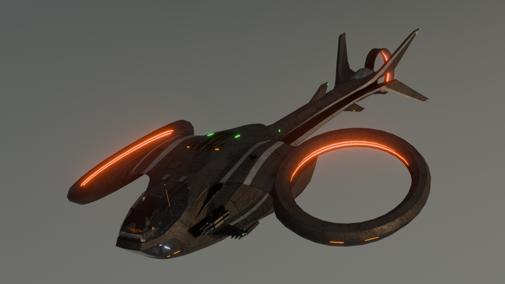
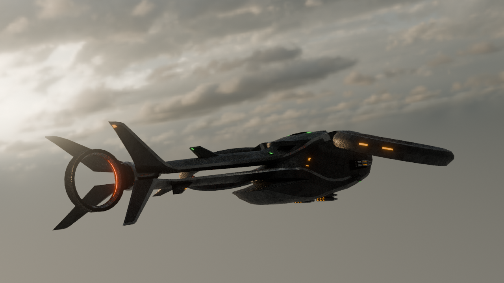
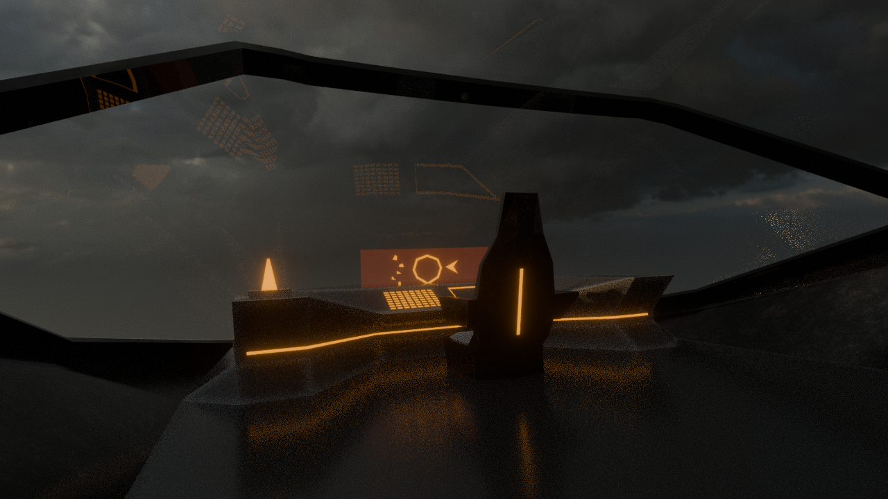

# X-REVENANT — 3D MODEL

## Overview

A high-detail futuristic VTOL combat copter created in Blender for Hack Club Stardance. Designed from scratch with custom tactical surfacing, dual-ring emission thrusters, detailed weapon assemblies, and a fully modeled cockpit interior.

## Concept & Design

The design was developed from sci-fi vehicle references and my own ideas, with a focus on creating an aggressive military silhouette while maintaining believable aerodynamic and mechanical forms.

## Modeling Process

* **Blockout & Iteration:** Reworked the main fuselage and wing geometry three times to refine the proportions, aerodynamic flow, and overall silhouette.
* **Hard-Surface Modeling:** Built the fuselage, wings, dual-ring thrusters, rear stabilizers, underwing weapon assemblies, and cockpit interior from scratch.
* **Detailing:** Added paneling, mechanical components, surface breaks, and smaller structural details across the vehicle.

## Shading & Rendering

* Created dark tactical metallic materials for the main body.
* Built custom glass shading for the cockpit.
* Added orange/red emission materials to the dual-ring thrusters.
* Used studio lighting to highlight reflections, ambient occlusion, and emissive details.

## Renders & Media

**Full Project:** [Google Drive](https://drive.google.com/drive/folders/1c-MOG1zaZe8c4xm1_dZhmIcbBx-zBP7R?usp=sharing)

*Contains the `.blend` file, screenshots, and project files.*

## Project Info

* **Software:** Blender
* **Type:** 3D Vehicle
* **Focus:** Hard-Surface Modeling, Shading & Rendering
* **Time Spent:** 45+ hours
* **Status:** Completed

